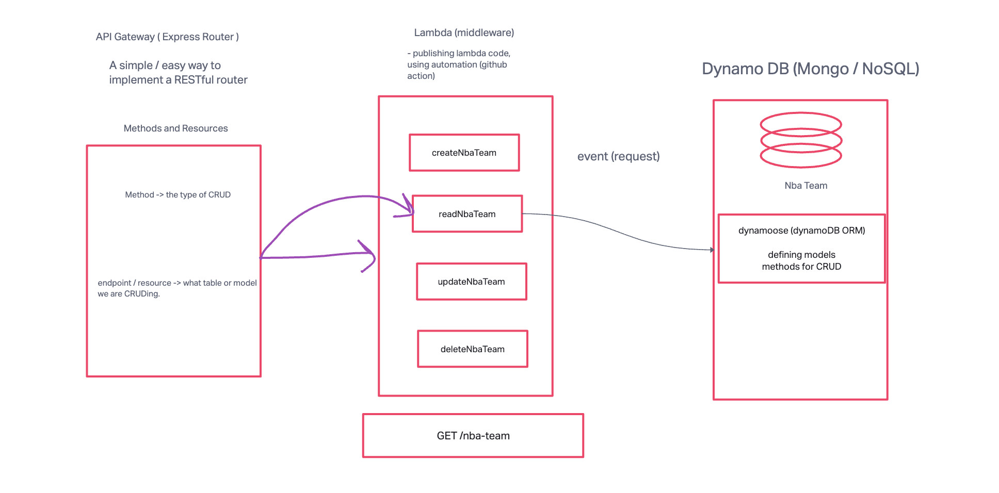

# Lab: AWS: API, Dynamo, and Lambda

## Overview

Create a serverless REST API using AWS Cloud Services, DynamoDB, and AWS Lambda functions.

## Feature Tasks & Requirements

Create a single resource REST API using a domain model of your choosing, constructed using AWS Cloud Services.

### Database: DynamoDB

- 1 Table required.

### Routing: API Gateway

- `**POST**` `/nba`
  - Given a JSON body, inserts a record into the database.
  - Returns an object representing one record by its ID (##).
- `**GET**` `/nba`
  - Returns an array of objects representing the records in the database.
- `**GET**` `/nba/##`
  - Returns an object representing one record by its ID (##).
- `**PUT**` `/nba/##`
  - Given a JSON body and an ID (##), updates a record in the database.
  - Returns an object representing one record by its ID (##).
- `**DELETE**` `/nba/##`
  - Given an ID (##), removes the matching record from the database.
  - Returns an empty object.

### Deployed URL

[Deployed URL](https://ej5yj69ql3.execute-api.us-west-2.amazonaws.com/Production)

### UML

